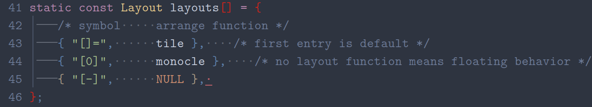

# Introduction



This plugin simply highlights whitespace as it should look like in a good
integrated development environment so you can differentiate between tabs,
spaces, and trailing whitespace.
Tabs are highlighted with straight lines and a pipe symbol to separate them.
Multiple spaces, leading spaces, and trailing spaces are marked with a simple
dot symbol.
Highlighting trailing whitespace with the `Error` highlight group is only done
when not in insert mode.
The result is smart, professional whitespace highlighting that makes Neovim look
like an IDE.

# Installation

## [vim-plug](https://github.com/junegunn/vim-plug)

```vim
Plug "amarakon/vim-markspace"
```
